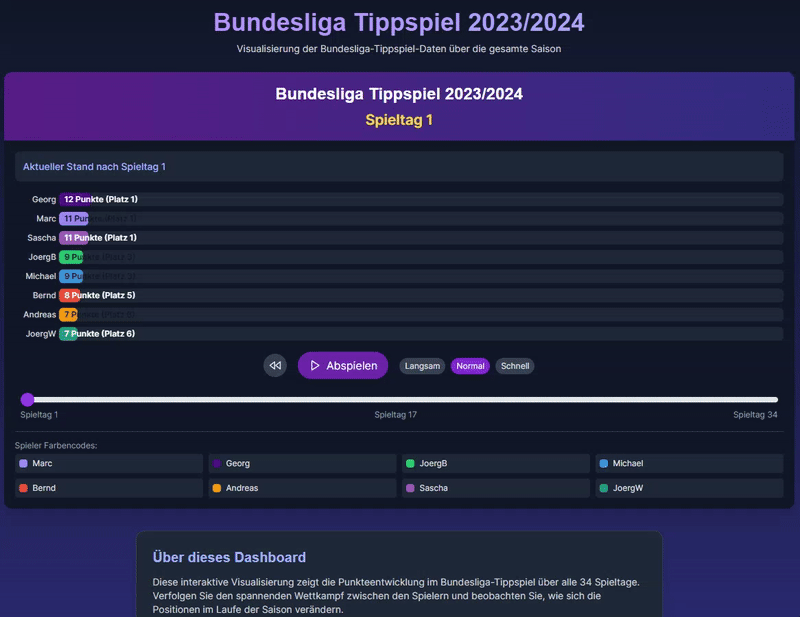

# Bundesliga Tippspiel 2023/2024 Visualisierung

Diese Anwendung visualisiert die Punkteentwicklung eines Bundesliga-Tippspiels für die Saison 2023/2024 als interaktives Balkenrennen.

## Demo



## Funktionen

- Anzeige der Punkteentwicklung von 8 Spielern über 34 Bundesliga-Spieltage
- Steuerelemente zum Abspielen, Pausieren und Zurücksetzen der Animation
- Einstellung der Animationsgeschwindigkeit (langsam, normal, schnell)
- Manuelle Navigation zwischen einzelnen Spieltagen
- Hervorhebung des Top-Performers für jeden Spieltag
- Farbkodierung für jeden Spieler

## Technologien

Dieses Projekt wurde mit folgenden Technologien erstellt:

- Vite
- TypeScript
- React
- Tailwind CSS
- Framer Motion für Animationen

## Entwicklung

Voraussetzung: Node.js & npm müssen installiert sein.

```sh
# Installation der Abhängigkeiten
npm install

# Entwicklungsserver starten
npm run dev
```

## Build

```sh
# Produktionsbuild erstellen
npm run build

# Vorschau des Builds
npm run preview
```
